# warelay Architecture Diagrams

This document contains all architectural diagrams for the warelay messaging relay system, with a focus on the Telegram MTProto integration design.

---

## 1. Current System Architecture

### 1.1 System Context

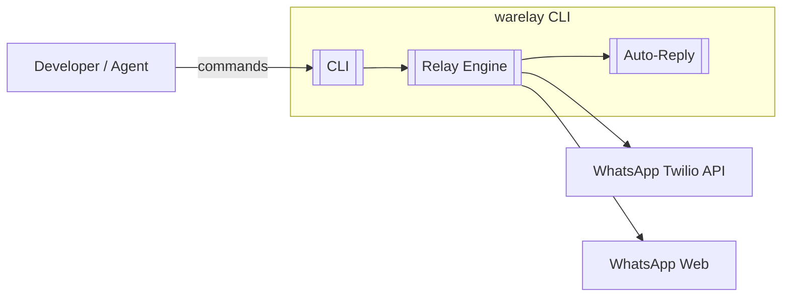
```mermaid
flowchart LR
  subgraph Warelay["warelay CLI"]
    CLI[[CLI]]
    Relay[[Relay Engine]]
    AutoReply[[Auto-Reply]]
  end

  User["Developer / Agent"]
  Twilio["WhatsApp Twilio API"]
  WhatsApp["WhatsApp Web"]

  User -->|commands| CLI
  CLI --> Relay
  Relay --> AutoReply
  Relay --> Twilio
  Relay --> WhatsApp
```

**Caption:** Current warelay system with two WhatsApp providers.

### 1.2 Current Provider Architecture

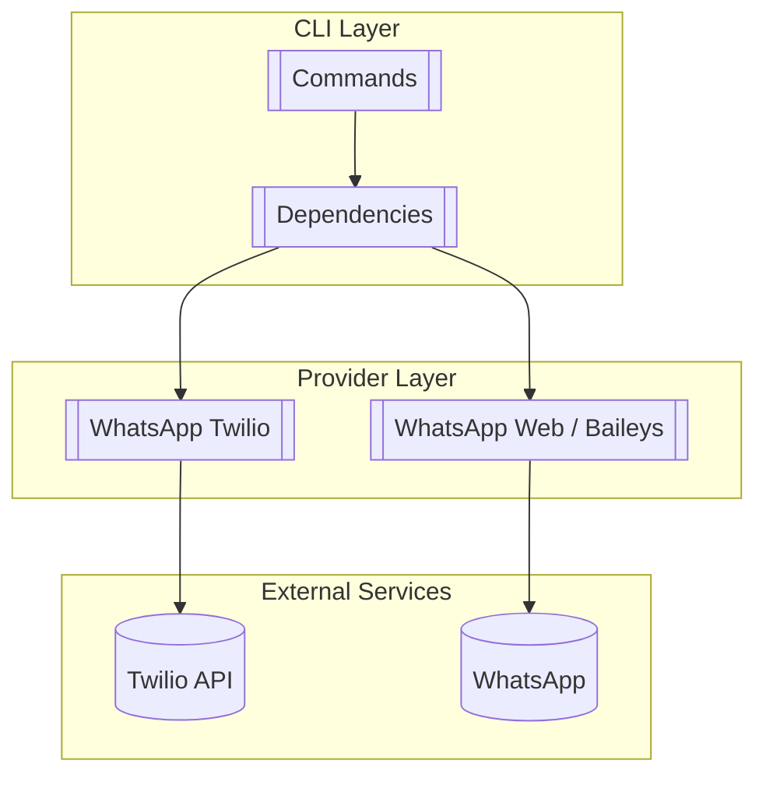
```mermaid
flowchart TB
  subgraph CLI["CLI Layer"]
    Cmds[[Commands]]
    Deps[[Dependencies]]
  end

  subgraph Providers["Provider Layer"]
    TwilioP[[WhatsApp Twilio]]
    WebP[[WhatsApp Web / Baileys]]
  end

  subgraph External["External Services"]
    TwilioAPI[(Twilio API)]
    WhatsAppSvc[(WhatsApp)]
  end

  Cmds --> Deps
  Deps --> TwilioP
  Deps --> WebP
  TwilioP --> TwilioAPI
  WebP --> WhatsAppSvc
```

**Caption:** Current provider layer showing lack of unified interface.

---

## 2. Provider Comparison

### 2.1 Message Flow Comparison

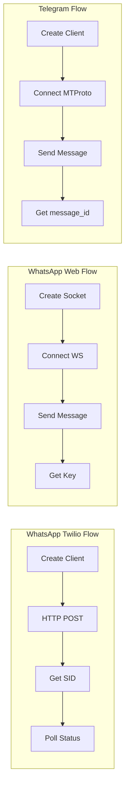
```mermaid
flowchart LR
  subgraph Twilio["WhatsApp Twilio Flow"]
    T1[Create Client] --> T2[HTTP POST]
    T2 --> T3[Get SID]
    T3 --> T4[Poll Status]
  end

  subgraph Web["WhatsApp Web Flow"]
    W1[Create Socket] --> W2[Connect WS]
    W2 --> W3[Send Message]
    W3 --> W4[Get Key]
  end

  subgraph Telegram["Telegram Flow"]
    TG1[Create Client] --> TG2[Connect MTProto]
    TG2 --> TG3[Send Message]
    TG3 --> TG4[Get message_id]
  end
```

**Caption:** Comparison of outbound message flows across providers.

### 2.2 Inbound Handling Comparison

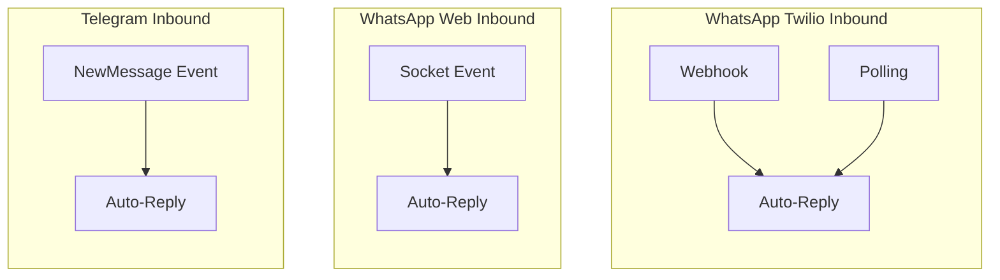
```mermaid
flowchart TB
  subgraph Twilio["WhatsApp Twilio Inbound"]
    direction TB
    TW[Webhook] --> TA[Auto-Reply]
    TP[Polling] --> TA
  end

  subgraph Web["WhatsApp Web Inbound"]
    direction TB
    WS[Socket Event] --> WA[Auto-Reply]
  end

  subgraph Telegram["Telegram Inbound"]
    direction TB
    TE[NewMessage Event] --> TGA[Auto-Reply]
  end
```

**Caption:** Inbound message handling patterns by provider.

---

## 3. Proposed Provider Abstraction

### 3.1 Provider Interface Layer

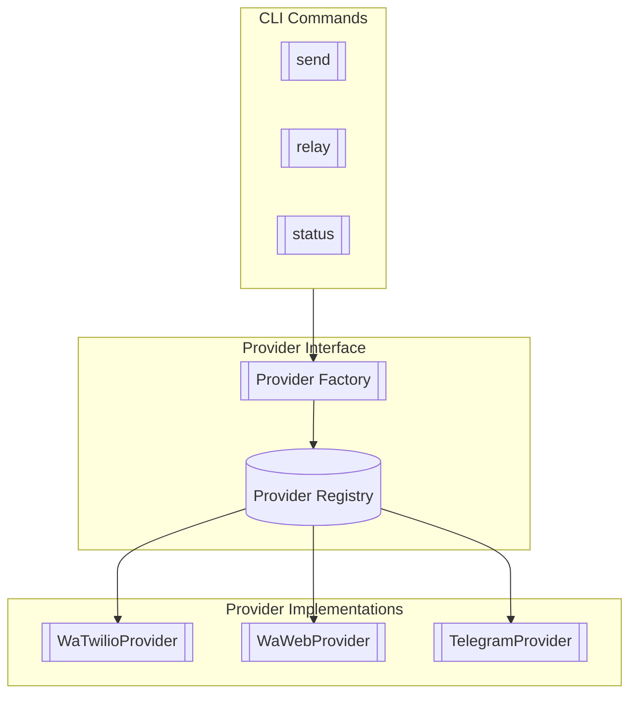
```mermaid
flowchart TB
  subgraph Commands["CLI Commands"]
    Send[[send]]
    Relay[[relay]]
    Status[[status]]
  end

  subgraph Interface["Provider Interface"]
    Factory[[Provider Factory]]
    Registry[(Provider Registry)]
  end

  subgraph Providers["Provider Implementations"]
    Twilio[[WaTwilioProvider]]
    Web[[WaWebProvider]]
    Telegram[[TelegramProvider]]
  end

  Commands --> Factory
  Factory --> Registry
  Registry --> Twilio
  Registry --> Web
  Registry --> Telegram
```

**Caption:** Proposed provider factory pattern with registry.

### 3.2 Unified Message Model

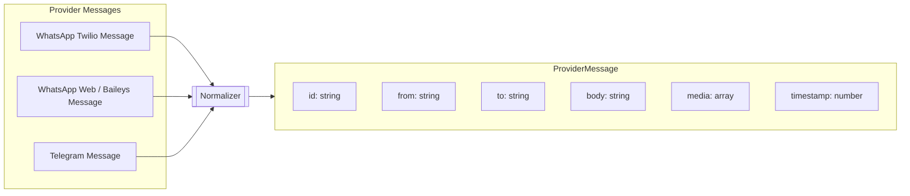
```mermaid
flowchart LR
  subgraph Inbound["Provider Messages"]
    TwilioMsg[WhatsApp Twilio Message]
    BaileysMsg[WhatsApp Web / Baileys Message]
    TelegramMsg[Telegram Message]
  end

  Normalize[[Normalizer]]

  subgraph Unified["ProviderMessage"]
    ID[id: string]
    From[from: string]
    To[to: string]
    Body[body: string]
    Media[media: array]
    Timestamp[timestamp: number]
  end

  TwilioMsg --> Normalize
  BaileysMsg --> Normalize
  TelegramMsg --> Normalize
  Normalize --> Unified
```

**Caption:** Message normalization from provider-specific to unified format.

### 3.3 Provider Lifecycle

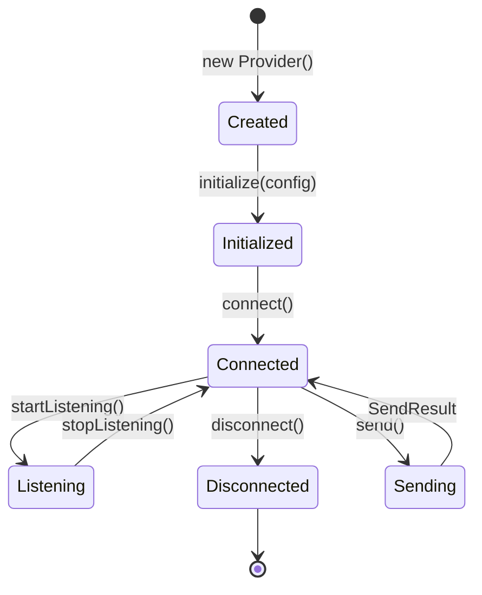
```mermaid
stateDiagram-v2
  [*] --> Created: new Provider()
  Created --> Initialized: initialize(config)
  Initialized --> Connected: connect()
  Connected --> Listening: startListening()
  Listening --> Connected: stopListening()
  Connected --> Disconnected: disconnect()
  Disconnected --> [*]

  Connected --> Sending: send()
  Sending --> Connected: SendResult
```

**Caption:** Provider state machine showing lifecycle transitions.

---

## 4. Telegram MTProto Design

### 4.1 Telegram Provider Architecture

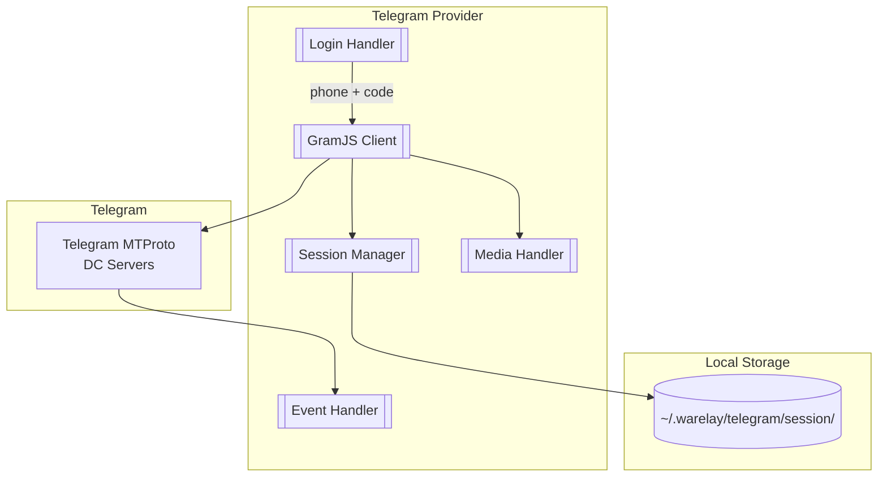
```mermaid
flowchart TB
  subgraph TelegramProvider["Telegram Provider"]
    Client[[GramJS Client]]
    Session[[Session Manager]]
    Login[[Login Handler]]
    Media[[Media Handler]]
    Events[[Event Handler]]
  end

  subgraph External["Telegram"]
    API["Telegram MTProto\nDC Servers"]
  end

  subgraph Storage["Local Storage"]
    SessionFile[("~/.warelay/telegram/session/")]
  end

  Login -->|phone + code| Client
  Client --> API
  API --> Events
  Client --> Session
  Session --> SessionFile
  Client --> Media
```

**Caption:** Telegram provider internal architecture using MTProto.

### 4.2 Telegram Login Flow

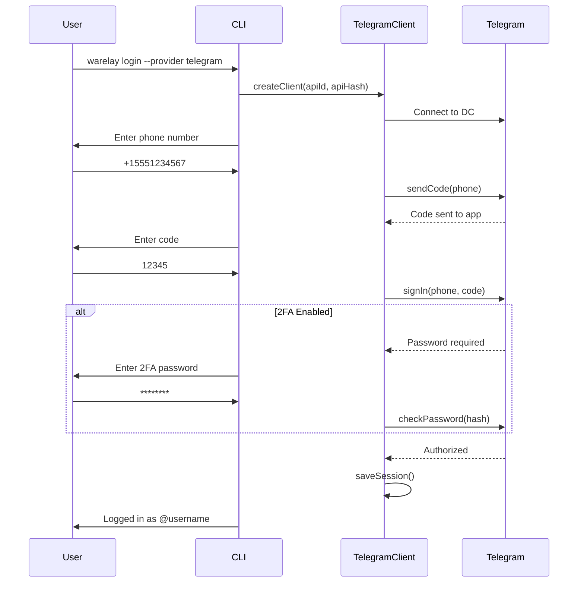
```mermaid
sequenceDiagram
  participant U as User
  participant C as CLI
  participant T as TelegramClient
  participant TG as Telegram

  U->>C: warelay login --provider telegram
  C->>T: createClient(apiId, apiHash)
  T->>TG: Connect to DC
  C->>U: Enter phone number
  U->>C: +15551234567
  T->>TG: sendCode(phone)
  TG-->>T: Code sent to app
  C->>U: Enter code
  U->>C: 12345
  T->>TG: signIn(phone, code)

  alt 2FA Enabled
    TG-->>T: Password required
    C->>U: Enter 2FA password
    U->>C: ********
    T->>TG: checkPassword(hash)
  end

  TG-->>T: Authorized
  T->>T: saveSession()
  C->>U: Logged in as @username
```

**Caption:** Interactive Telegram login flow with optional 2FA.

### 4.3 Telegram Send Flow

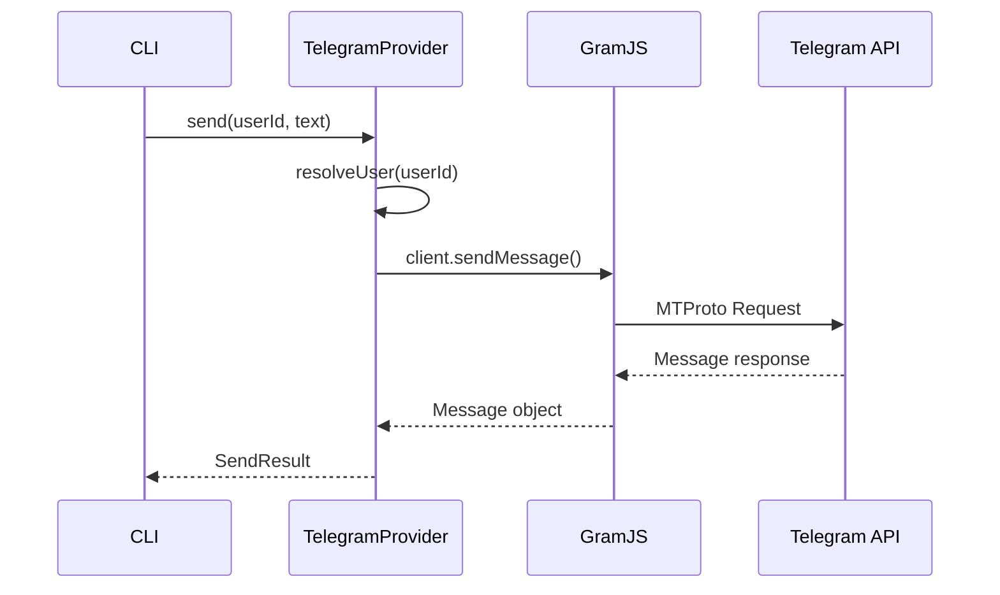
```mermaid
sequenceDiagram
  participant C as CLI
  participant P as TelegramProvider
  participant G as GramJS
  participant A as Telegram API

  C->>P: send(userId, text)
  P->>P: resolveUser(userId)
  P->>G: client.sendMessage()
  G->>A: MTProto Request
  A-->>G: Message response
  G-->>P: Message object
  P-->>C: SendResult
```

**Caption:** Telegram outbound message sequence.

### 4.4 Telegram Relay Flow

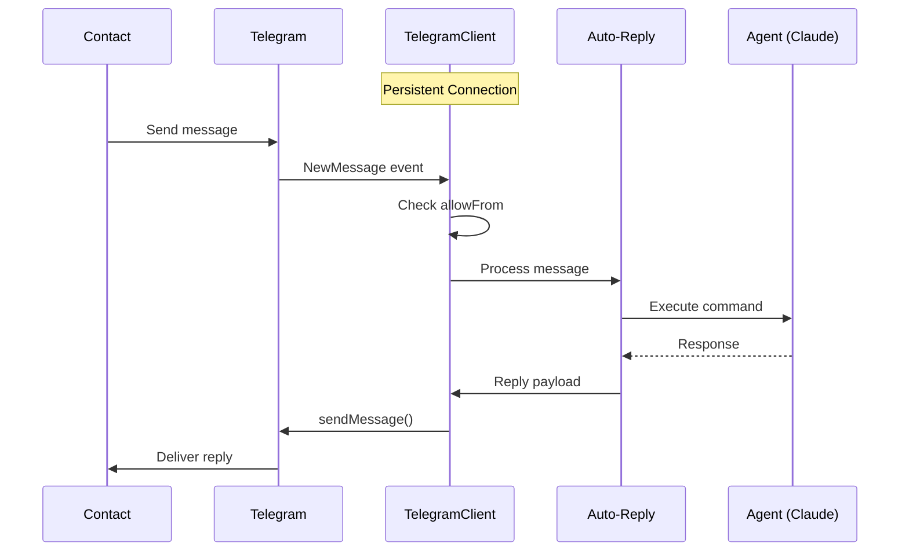
```mermaid
sequenceDiagram
  participant U as Contact
  participant TG as Telegram
  participant C as TelegramClient
  participant AR as Auto-Reply
  participant A as Agent (Claude)

  Note over C: Persistent Connection

  U->>TG: Send message
  TG->>C: NewMessage event
  C->>C: Check allowFrom
  C->>AR: Process message
  AR->>A: Execute command
  A-->>AR: Response
  AR->>C: Reply payload
  C->>TG: sendMessage()
  TG->>U: Deliver reply
```

**Caption:** Telegram relay mode with auto-reply using persistent connection.

---

## 5. Security Model

### 5.1 allowFrom Whitelist

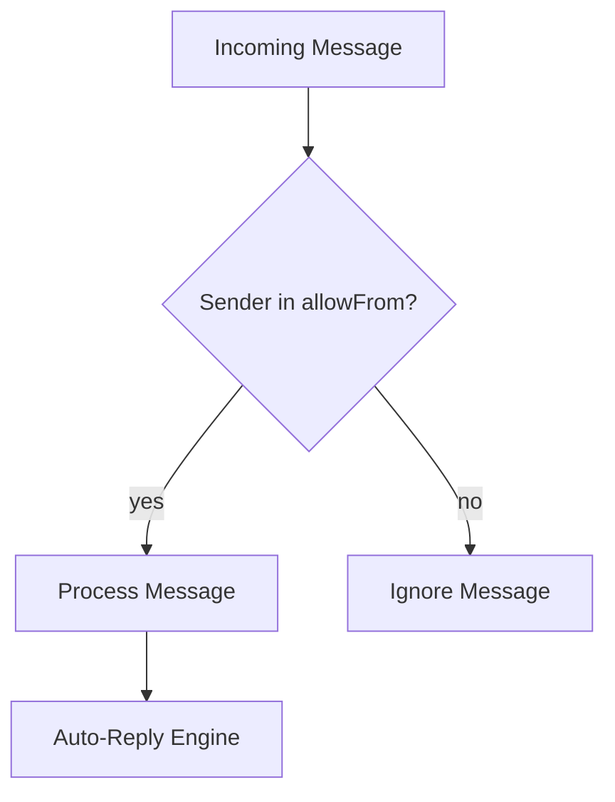
```mermaid
flowchart TB
  Inbound[Incoming Message]
  Check{Sender in allowFrom?}
  Allow[Process Message]
  Deny[Ignore Message]

  Inbound --> Check
  Check -->|yes| Allow
  Check -->|no| Deny
  Allow --> AutoReply[Auto-Reply Engine]
```

**Caption:** `allowFrom` whitelist filtering (same model for WhatsApp and Telegram).

### 5.2 Provider Security Comparison

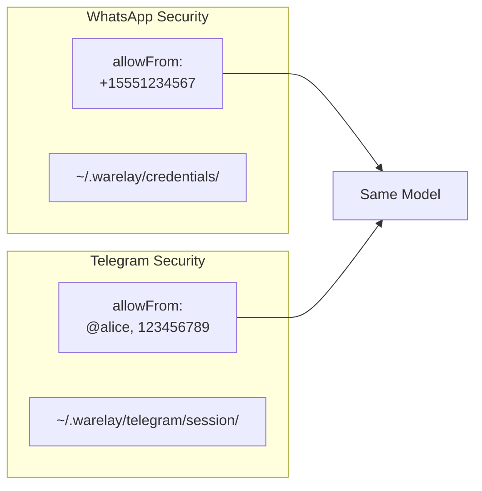
```mermaid
flowchart LR
  subgraph WhatsApp["WhatsApp Security"]
    WA_Allow["allowFrom:\n+15551234567"]
    WA_Session["~/.warelay/credentials/"]
  end

  subgraph Telegram["Telegram Security"]
    TG_Allow["allowFrom:\n@alice, 123456789"]
    TG_Session["~/.warelay/telegram/session/"]
  end

  WA_Allow --> Same["Same Model"]
  TG_Allow --> Same
```

**Caption:** Both providers use identical `allowFrom` whitelist security model.

---

## 6. Configuration Architecture

### 6.1 Configuration Sources

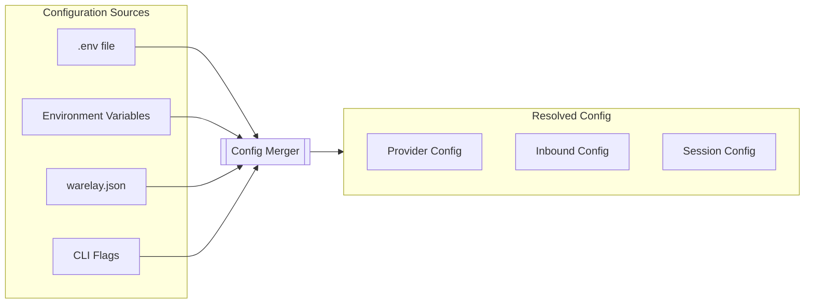
```mermaid
flowchart LR
  subgraph Sources["Configuration Sources"]
    Env[".env file"]
    EnvVars["Environment Variables"]
    Config["warelay.json"]
    CLI["CLI Flags"]
  end

  Merge[[Config Merger]]

  subgraph Final["Resolved Config"]
    Provider[Provider Config]
    Inbound[Inbound Config]
    Session[Session Config]
  end

  Env --> Merge
  EnvVars --> Merge
  Config --> Merge
  CLI --> Merge
  Merge --> Final
```

**Caption:** Configuration resolution from multiple sources.

### 6.2 Provider Selection Algorithm

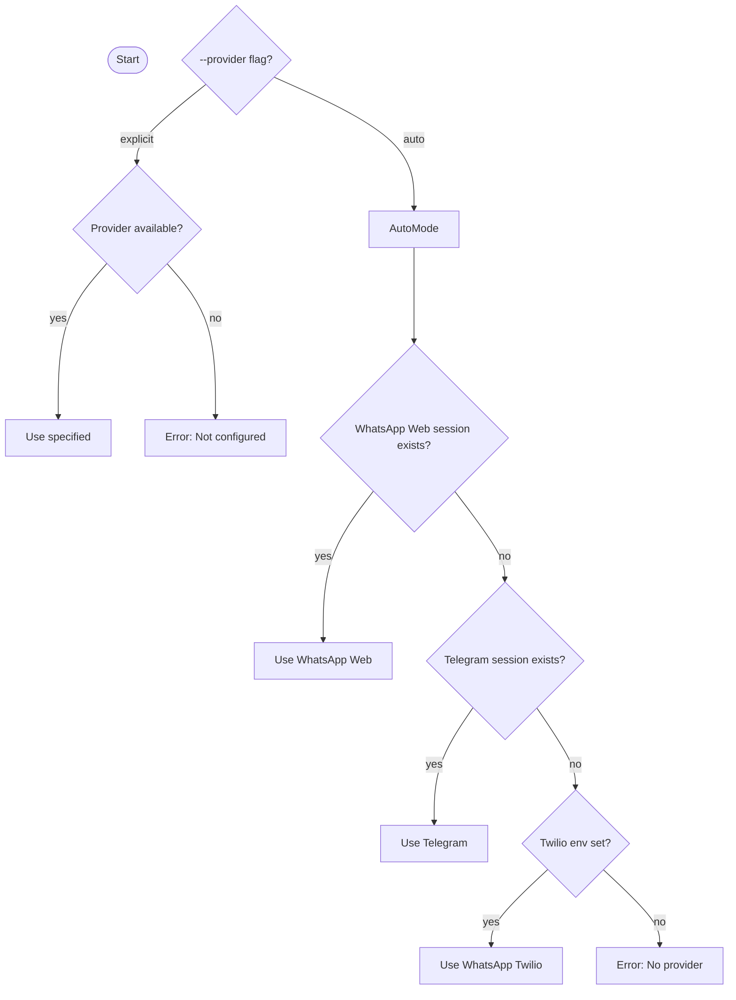
```mermaid
flowchart TB
  Start([Start])
  Flag{--provider flag?}

  Flag -->|explicit| CheckExplicit{Provider available?}
  Flag -->|auto| AutoMode

  CheckExplicit -->|yes| UseExplicit[Use specified]
  CheckExplicit -->|no| Error[Error: Not configured]

  AutoMode --> WebAuth{WhatsApp Web session exists?}
  WebAuth -->|yes| UseWeb[Use WhatsApp Web]
  WebAuth -->|no| TelegramAuth{Telegram session exists?}
  TelegramAuth -->|yes| UseTelegram[Use Telegram]
  TelegramAuth -->|no| TwilioEnv{Twilio env set?}
  TwilioEnv -->|yes| UseTwilio[Use WhatsApp Twilio]
  TwilioEnv -->|no| NoProvider[Error: No provider]
```

**Caption:** Extended provider auto-selection with Telegram.

---

## 7. Implementation Phases

### 7.1 Phase Overview

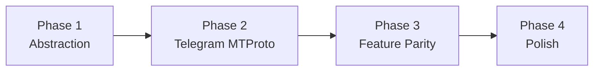
```mermaid
flowchart LR
  P1[Phase 1\nAbstraction]
  P2[Phase 2\nTelegram MTProto]
  P3[Phase 3\nFeature Parity]
  P4[Phase 4\nPolish]

  P1 --> P2 --> P3 --> P4
```

**Caption:** Implementation timeline for Telegram integration.

### 7.2 File Structure Changes

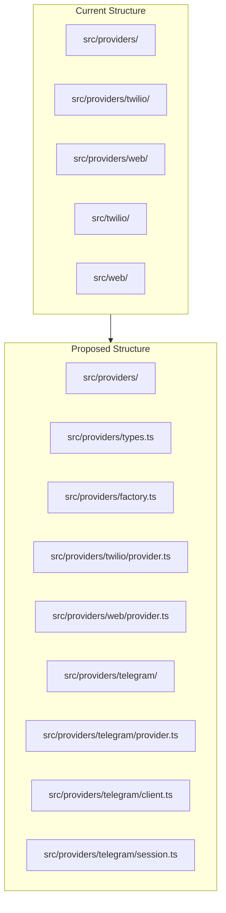
```mermaid
flowchart TB
  subgraph Current["Current Structure"]
    C1[src/providers/]
    C2[src/providers/twilio/]
    C3[src/providers/web/]
    C4[src/twilio/]
    C5[src/web/]
  end

  subgraph Proposed["Proposed Structure"]
    P1[src/providers/]
    P2[src/providers/types.ts]
    P3[src/providers/factory.ts]
    P4[src/providers/twilio/provider.ts]
    P5[src/providers/web/provider.ts]
    P6[src/providers/telegram/]
    P7[src/providers/telegram/provider.ts]
    P8[src/providers/telegram/client.ts]
    P9[src/providers/telegram/session.ts]
  end

  Current --> Proposed
```

**Caption:** File structure evolution for provider abstraction.

---

## 8. Data Flow Diagrams

### 8.1 Complete Send Flow

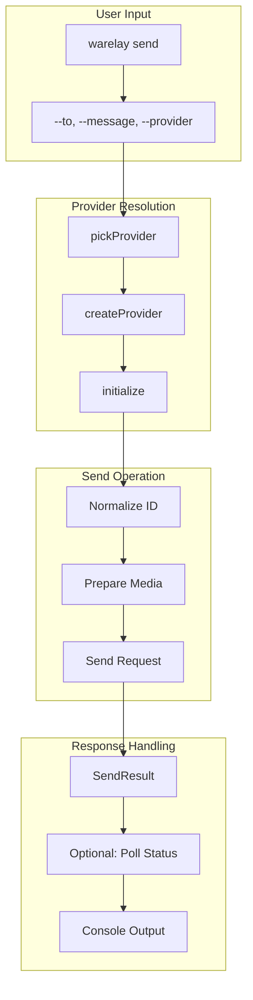
```mermaid
flowchart TB
  subgraph Input["User Input"]
    CLI[warelay send]
    Args["--to, --message, --provider"]
  end

  subgraph Resolution["Provider Resolution"]
    Pick[pickProvider]
    Factory[createProvider]
    Init[initialize]
  end

  subgraph Send["Send Operation"]
    Norm[Normalize ID]
    Media[Prepare Media]
    Req[Send Request]
  end

  subgraph Response["Response Handling"]
    Result[SendResult]
    Status[Optional: Poll Status]
    Output[Console Output]
  end

  CLI --> Args
  Args --> Pick
  Pick --> Factory
  Factory --> Init
  Init --> Norm
  Norm --> Media
  Media --> Req
  Req --> Result
  Result --> Status
  Status --> Output
```

**Caption:** Complete send operation data flow.

### 8.2 Complete Relay Flow

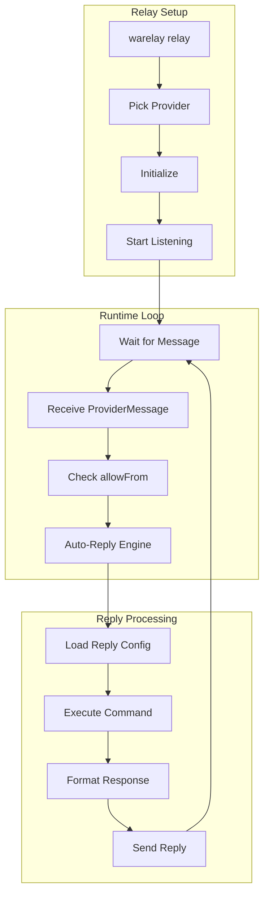
```mermaid
flowchart TB
  subgraph Setup["Relay Setup"]
    Start[warelay relay]
    Pick[Pick Provider]
    Init[Initialize]
    Listen[Start Listening]
  end

  subgraph Runtime["Runtime Loop"]
    Wait[Wait for Message]
    Receive[Receive ProviderMessage]
    Authorize[Check allowFrom]
    Process[Auto-Reply Engine]
  end

  subgraph Reply["Reply Processing"]
    Config[Load Reply Config]
    Command[Execute Command]
    Format[Format Response]
    Send[Send Reply]
  end

  Start --> Pick --> Init --> Listen
  Listen --> Wait
  Wait --> Receive
  Receive --> Authorize
  Authorize --> Process
  Process --> Config
  Config --> Command
  Command --> Format
  Format --> Send
  Send --> Wait
```

**Caption:** Relay mode runtime flow.

---

## 9. Error Handling

### 9.1 Provider Error States

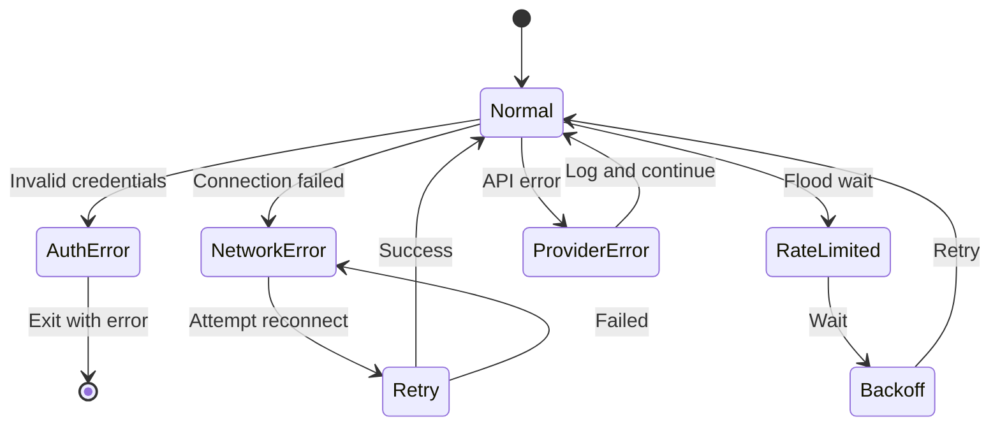
```mermaid
stateDiagram-v2
  [*] --> Normal

  Normal --> AuthError: Invalid credentials
  Normal --> NetworkError: Connection failed
  Normal --> RateLimited: Flood wait
  Normal --> ProviderError: API error

  AuthError --> [*]: Exit with error
  NetworkError --> Retry: Attempt reconnect
  Retry --> Normal: Success
  Retry --> NetworkError: Failed
  RateLimited --> Backoff: Wait
  Backoff --> Normal: Retry
  ProviderError --> Normal: Log and continue
```

**Caption:** Error handling state machine.

### 9.2 Reconnection Strategy

```mermaid
flowchart TB
  Disconnect[Connection Lost]
  Attempt[Reconnect Attempt]
  Backoff[Calculate Backoff]
  Wait[Wait]
  Check{Success?}
  MaxCheck{Max attempts?}

  Disconnect --> Attempt
  Attempt --> Check
  Check -->|yes| Connected[Connected]
  Check -->|no| MaxCheck
  MaxCheck -->|yes| Failed[Give Up]
  MaxCheck -->|no| Backoff
  Backoff --> Wait
  Wait --> Attempt
```

**Caption:** Reconnection with exponential backoff.

---

## 10. Provider Comparison Summary

### 10.1 Authentication Methods

```mermaid
flowchart LR
  subgraph Twilio["WhatsApp Twilio"]
    T_Auth["API Key + Token\n(env vars)"]
  end

  subgraph Web["WhatsApp Web"]
    W_Auth["QR Code Scan\n(session files)"]
  end

  subgraph Telegram["Telegram"]
    TG_Auth["Phone + Code + 2FA\n(session files)"]
  end
```

**Caption:** Authentication method comparison across providers.

### 10.2 Connection Types

```mermaid
flowchart LR
  subgraph Twilio["WhatsApp Twilio"]
    T_Conn["Stateless HTTP"]
  end

  subgraph Web["WhatsApp Web"]
    W_Conn["Persistent WebSocket"]
  end

  subgraph Telegram["Telegram"]
    TG_Conn["Persistent MTProto"]
  end
```

**Caption:** Connection type comparison across providers.

---

## Appendix: Diagram Legend

| Shape | Meaning |
|-------|---------|
| `[[Service]]` | Service/Application component |
| `[(Database)]` | Data store |
| `[Box]` | Generic component |
| `([Round])` | Start/End state |
| `{Diamond}` | Decision point |
| `-->` | Data/control flow |
| `subgraph` | Logical boundary |
